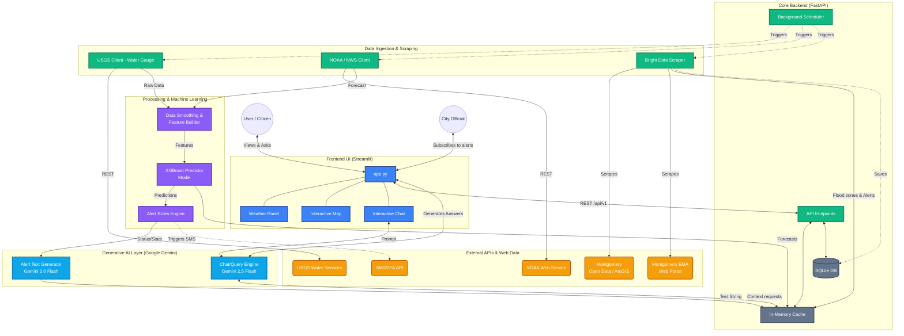

# StormShield AI - High Level Architecture

Here is the high-level architecture diagram of the StormShield AI application based on the current codebase.

```mermaid
flowchart TB
    %% Definitions
    classDef frontend fill:#3b82f6,stroke:#1e3a8a,stroke-width:2px,color:#fff
    classDef backend fill:#10b981,stroke:#047857,stroke-width:2px,color:#fff
    classDef ml fill:#8b5cf6,stroke:#5b21b6,stroke-width:2px,color:#fff
    classDef external fill:#f59e0b,stroke:#b45309,stroke-width:2px,color:#fff
    classDef storage fill:#64748b,stroke:#334155,stroke-width:2px,color:#fff
    classDef gemini fill:#0ea5e9,stroke:#0369a1,stroke-width:2px,color:#fff

    %% User Layer
    User((User / Citizen))
    Admin((City Official))
    
    %% Frontend Streamlit Interface
    subgraph UI ["Frontend UI (Streamlit)"]
        StreamlitApp[app.py]:::frontend
        WeatherPanel[Weather Panel]:::frontend
        FloodMap[Interactive Map]:::frontend
        LLMChat[Interactive Chat]:::frontend
    end
    
    %% Backend FastAPI Service
    subgraph CoreBackend ["Core Backend (FastAPI)"]
        API[API Endpoints]:::backend
        Cache[In-Memory Cache]:::storage
        DB[(SQLite DB)]:::storage
        
        Scheduler[Background Scheduler]:::backend
    end
    
    %% Ingestion Modules
    subgraph Ingestion ["Data Ingestion & Scraping"]
        USGSClient[USGS Client - Water Gauge]:::backend
        NOAAClient[NOAA / NWS Client]:::backend
        BrightData[Bright Data Scraper]:::backend
    end

    %% Data Processing & ML
    subgraph ProcessingML ["Processing & Machine Learning"]
        FeatureBuilder[Data Smoothing &\nFeature Builder]:::ml
        XGBoost[XGBoost Predictor\nModel]:::ml
        AlertEngine[Alert Rules Engine]:::ml
    end

    %% Generative AI Layer
    subgraph GenAI ["Generative AI Layer (Google Gemini)"]
        LLMAlerts[Alert Text Generator\nGemini 2.0 Flash]:::gemini
        QueryEngine[Chat/Query Engine\nGemini 2.5 Flash]:::gemini
    end
    
    %% External APIs
    subgraph ExternalServices ["External APIs & Web Data"]
        USGSAPI(USGS Water Services):::external
        NOAAAPI(NOAA Web Service):::external
        MontgomeryOpenData(Montgomery \nOpen Data / ArcGIS):::external
        MontgomeryEMA(Montgomery EMA \nWeb Portal):::external
        TwilioAPI(SMS/2FA API):::external
    end
    
    %% --- Connections ---

    %% User to UI
    User <--> |Views & Asks| StreamlitApp
    Admin <--> |Subscribes to alerts| StreamlitApp
    StreamlitApp --- WeatherPanel
    StreamlitApp --- FloodMap
    StreamlitApp --- LLMChat

    %% UI to Backend
    StreamlitApp <--> |REST /api/v1| API
    
    %% Backend Internal
    API <--> Cache
    API <--> DB
    Scheduler -.-> |Triggers| USGSClient
    Scheduler -.-> |Triggers| NOAAClient
    Scheduler -.-> |Triggers| BrightData
    
    %% Ingestion to External
    USGSClient --> |REST| USGSAPI
    NOAAClient --> |REST| NOAAAPI
    BrightData --> |Scrapes| MontgomeryOpenData
    BrightData --> |Scrapes| MontgomeryEMA
    
    %% Ingestion to Processing
    USGSClient --> |Raw Data| FeatureBuilder
    NOAAClient --> |Forecast| FeatureBuilder
    BrightData --> |Flood zones & Alerts| Cache
    BrightData -.-> |Saves| DB
    
    %% Processing to Alerting
    FeatureBuilder --> |Features| XGBoost
    XGBoost --> |Predictions| AlertEngine
    AlertEngine --> |Status/State| LLMAlerts
    LLMAlerts --> |Text String| Cache
    AlertEngine -.-> |Triggers SMS| TwilioAPI
    
    %% Prediction to UI
    XGBoost --> |Forecasts| Cache
    
    %% LLM Querying
    LLMChat <--> |Prompt| QueryEngine
    QueryEngine <--> |Context requests| Cache
    QueryEngine <--> |Generates Answers| StreamlitApp
```
